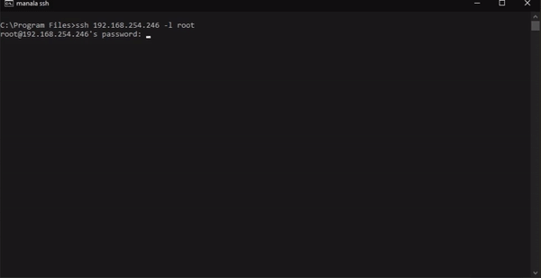

# Custom-RockPi-setup



With this simple setup it is possible to customize a new installation of DietPi on the RockPi4 like I always do. It is possible to do single parts of this installation on other boards. 

### What is possible so far:

- Change the Bash-Promt
- Change MOTD for DietPi
- Wireguard installation on a RockPi with DietPi
- PiHole installation (Simple)


Bash-Promt Example:


**Usage:**

```bash
 $ git clone https://github.com/twerpyfie/CustomRP.git
 $ cd CustomRP
 $ sudo chmod +x ./Setup
 $ sudo bash ./Setup
```

### To do:

- Include wireguard configurator
- Include wireguard QR-Code generator for Peers
- Maby make some new Repositorys for the other Projects included
- Maby make an updater
